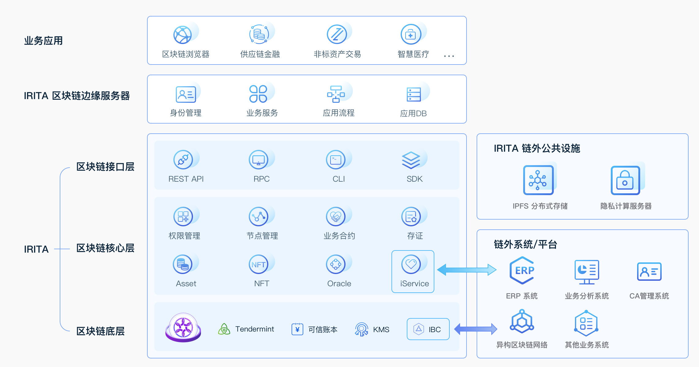

# IRITA OPB文档

## 文昌链（IRITA OPB）简介

“文昌”链（IRITA OPB）是边界智能在BSN环境中部署的基于智能合约的开放许可链平台。文昌链基于边界智能的IRITA产品，并对COSMOS/IRISnet 进行改造，既利用了公链成熟的底层技术框架，又满足了中国市场的监管要求。提供对节点部署的许可控制，并取消使用 Token 支付 GAS（能量值） 的机制，能更好的满足中小企业以更具成本效益的方式快速开发和部署 DApp 的需求。

文昌链（IRITA OPB）支持使用EVM、WebAssembly (WASM)来执行用户编写的智能合约，并提供了多种IDE环境，便于开发者快速地搭建智能合约开发环境，进行合约开发、编译、调试、测试和发布部署。

文昌链（IRITA OPB）所基于的IRITA联盟链产品在6大方面具有核心技术优势：

- 采用了Tendermint作为共识机制，是首个互联网级别可应用的拜占庭共识协议；
- 集成了COSMOS/IRISnet的IBC跨链协议，是业内公认的、最前沿跨链技术标准；
- 支持数据在链上加密存储和授权情况下的分享，保护各方数据所有权和隐私；
- 支持使用EVM和WebAssembly (WASM)等多种方式来执行用户编写的智能合约；
- 支持传统数据仓库和链式数据结合的情况下链上数据高效全生命周期查询；

## IRITA 解决方案整体架构

使用IRITA联盟链产品的区块链行业解决方案架构示例如下：

其中，IRITA产品可提供包括区块链核心层、接口层的强大底层支持功能。除了区块链之外，IRITA还集成了分布式存储、身份证书管理、隐私计算等链外能力。以IRITA底层平台为基础，开发者可为各行业灵活定制边缘应用服务（EdgeServer）以及业务应用，并可通过IBC和iService连接各类外部的异构系统。

### IRITA服务

IRITA服务（又名“iService”）的目标是弥合区块链世界与传统商业应用世界之间的鸿沟，居中协调链下服务的整个生命周期 - 从定义、绑定（提供者注册）、调用，直到它们的治理（描画和仲裁）。

### 生命周期

- 定义：根据接口定义语言（IDL）文件定义链下iService可以做什么。
- 绑定：声明实现给​​定iService定义的提供者端点的位置（地址），定价和服务质量。
- 调用：处理针对给定iService提供者端点的消费者请求以及相应的提供者响应。

### 提供者

提供者 （Provider）是提供一个或多个iService定义实现的网络用户，通常充当位于其他公有链、联盟链以及企业现有系统中的链下服务和资源的 适配器。它们监听和处理传入的请求，并将响应发送回网络。提供者可以通过向其他提供者发送请求来同时充当消费者。按照计划，提供者需要为他们可能提供的服务收取费用。

### 消费者

消费者（Consumer）是那些使用iService的用户，他们向指定的提供者端点发送请求并接收相关提供者的响应。

### 分析员

分析员（Profiler）是一种特殊用户。分析员是在分析模式中调用iService的唯一授权用户，旨在帮助创建和维护服务提供者的分析画像，通过这些客观的分析画像服务消费者可以选择合适的服务提供者。

### 仲裁员

仲裁员 （Arbitrator）是自我声明的一类用户，他们协助消费者对投诉（服务提供者的表现）进行仲裁。

## 安装

考虑到安全问题，本软件不提供二进制文件方式安装，只提供源码安装，具体请参考安装[文档](get-started/installation.md)
